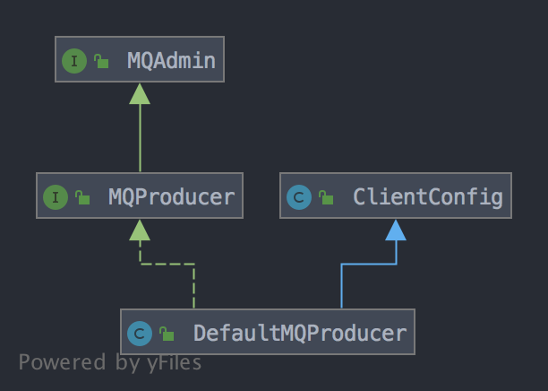

## 如何实现消息发送
rocketmq中发送消息的方式有3种：
### 同步发送
```java
public class SyncProducer {
	public static void main(String[] args) throws Exception {
    	// 实例化消息生产者Producer
        DefaultMQProducer producer = new DefaultMQProducer("please_rename_unique_group_name");
    	// 设置NameServer的地址
    	producer.setNamesrvAddr("localhost:9876");
    	// 启动Producer实例
      producer.start();
    	for (int i = 0; i < 100; i++) {
    	    // 创建消息，并指定Topic，Tag和消息体
    	    Message msg = new Message("TopicTest" /* Topic */,
        	"TagA" /* Tag */,
        	("Hello RocketMQ " + i).getBytes(RemotingHelper.DEFAULT_CHARSET) /* Message body */
        	);
        	// 发送消息到一个Broker
            SendResult sendResult = producer.send(msg);
            // 通过sendResult返回消息是否成功送达
            System.out.printf("%s%n", sendResult);
    	}
    	// 如果不再发送消息，关闭Producer实例。
    	producer.shutdown();
    }
}
```

### 异步发送
```java
public class AsyncProducer {
	public static void main(String[] args) throws Exception {
    	// 实例化消息生产者Producer
        DefaultMQProducer producer = new DefaultMQProducer("please_rename_unique_group_name");
    	// 设置NameServer的地址
        producer.setNamesrvAddr("localhost:9876");
    	// 启动Producer实例
        producer.start();
        producer.setRetryTimesWhenSendAsyncFailed(0);
	
	int messageCount = 100;
        // 根据消息数量实例化倒计时计算器
	final CountDownLatch2 countDownLatch = new CountDownLatch2(messageCount);
    	for (int i = 0; i < messageCount; i++) {
                final int index = i;
            	// 创建消息，并指定Topic，Tag和消息体
                Message msg = new Message("TopicTest",
                    "TagA",
                    "OrderID188",
                    "Hello world".getBytes(RemotingHelper.DEFAULT_CHARSET));
                // SendCallback接收异步返回结果的回调
                producer.send(msg, new SendCallback() {
                    @Override
                    public void onSuccess(SendResult sendResult) {
                        System.out.printf("%-10d OK %s %n", index,
                            sendResult.getMsgId());
                    }
                    @Override
                    public void onException(Throwable e) {
      	              System.out.printf("%-10d Exception %s %n", index, e);
      	              e.printStackTrace();
                    }
            	});
    	}
	// 等待5s
	countDownLatch.await(5, TimeUnit.SECONDS);
    	// 如果不再发送消息，关闭Producer实例。
    	producer.shutdown();
    }
}
```

### 单向发送
```java
public class OnewayProducer {
	public static void main(String[] args) throws Exception{
    	// 实例化消息生产者Producer
        DefaultMQProducer producer = new DefaultMQProducer("please_rename_unique_group_name");
    	// 设置NameServer的地址
        producer.setNamesrvAddr("localhost:9876");
    	// 启动Producer实例
        producer.start();
    	for (int i = 0; i < 100; i++) {
        	// 创建消息，并指定Topic，Tag和消息体
        	Message msg = new Message("TopicTest" /* Topic */,
                "TagA" /* Tag */,
                ("Hello RocketMQ " + i).getBytes(RemotingHelper.DEFAULT_CHARSET) /* Message body */
        	);
        	// 发送单向消息，没有任何返回结果
        	producer.sendOneway(msg);

    	}
    	// 如果不再发送消息，关闭Producer实例。
    	producer.shutdown();
    }
}
```

这三种发送方式的底层实现已经在笔记[remoting模块的作用和实现](../../my_doc/公共组件/remoting模块的作用和实现.md)分析了，这里假设阅读当前文档时已经对[remoting模块的作用和实现](../../my_doc/公共组件/remoting模块的作用和实现.md)有了一定了解，这里关于消息发送的实现分析的关注点在于：
1. 如何获取到路由信息
2. 如何根据路由信息选择broker
3. 发送失败如何处理
4. rocketmq的topic自动创建机制

这里直接从`DefaultMQProducer`的源码开始分析，一边分析一边寻找上面关注点的答案。`DefaultMQProducer`的继承关系如下：


`MQAdmin`接口在笔记[mqadmin命令的实现](../../tools/mqadmin命令的实现.md)中已经介绍了，该接口定义了一些管理rocketmq集群的方法：
```java
public interface MQAdmin {
    void createTopic(final String key, final String newTopic, final int queueNum)
        throws MQClientException;

    void createTopic(String key, String newTopic, int queueNum, int topicSysFlag)
        throws MQClientException;

    long searchOffset(final MessageQueue mq, final long timestamp) throws MQClientException;

    long maxOffset(final MessageQueue mq) throws MQClientException;

    long minOffset(final MessageQueue mq) throws MQClientException;

    long earliestMsgStoreTime(final MessageQueue mq) throws MQClientException;

    MessageExt viewMessage(final String offsetMsgId) throws RemotingException, MQBrokerException,
        InterruptedException, MQClientException;

    QueryResult queryMessage(final String topic, final String key, final int maxNum, final long begin,
        final long end) throws MQClientException, InterruptedException;

    MessageExt viewMessage(String topic,
        String msgId) throws RemotingException, MQBrokerException, InterruptedException, MQClientException;

}
```

上面方法的作用从方法名和方法参数就可以看出来，对于这些方法的实现，在分析代码的过程中如果有需要就分析，这些方法不是当前笔记的关注点。

`MQProducer`接口继承自`MQAdmin`接口，定义了一个生产者需要实现的方法：
```java
public interface MQProducer extends MQAdmin {
    void start() throws MQClientException;

    void shutdown();

    List<MessageQueue> fetchPublishMessageQueues(final String topic) throws MQClientException;

    SendResult send(final Message msg) throws MQClientException, RemotingException, MQBrokerException,
        InterruptedException;

    SendResult send(final Message msg, final long timeout) throws MQClientException,
        RemotingException, MQBrokerException, InterruptedException;

    void send(final Message msg, final SendCallback sendCallback) throws MQClientException,
        RemotingException, InterruptedException;

    void send(final Message msg, final SendCallback sendCallback, final long timeout)
        throws MQClientException, RemotingException, InterruptedException;

    void sendOneway(final Message msg) throws MQClientException, RemotingException,
        InterruptedException;

    SendResult send(final Message msg, final MessageQueue mq) throws MQClientException,
        RemotingException, MQBrokerException, InterruptedException;

    SendResult send(final Message msg, final MessageQueue mq, final long timeout)
        throws MQClientException, RemotingException, MQBrokerException, InterruptedException;

    void send(final Message msg, final MessageQueue mq, final SendCallback sendCallback)
        throws MQClientException, RemotingException, InterruptedException;

    void send(final Message msg, final MessageQueue mq, final SendCallback sendCallback, long timeout)
        throws MQClientException, RemotingException, InterruptedException;

    void sendOneway(final Message msg, final MessageQueue mq) throws MQClientException,
        RemotingException, InterruptedException;

    SendResult send(final Message msg, final MessageQueueSelector selector, final Object arg)
        throws MQClientException, RemotingException, MQBrokerException, InterruptedException;

    SendResult send(final Message msg, final MessageQueueSelector selector, final Object arg,
        final long timeout) throws MQClientException, RemotingException, MQBrokerException,
        InterruptedException;

    void send(final Message msg, final MessageQueueSelector selector, final Object arg,
        final SendCallback sendCallback) throws MQClientException, RemotingException,
        InterruptedException;

    void send(final Message msg, final MessageQueueSelector selector, final Object arg,
        final SendCallback sendCallback, final long timeout) throws MQClientException, RemotingException,
        InterruptedException;

    void sendOneway(final Message msg, final MessageQueueSelector selector, final Object arg)
        throws MQClientException, RemotingException, InterruptedException;

    TransactionSendResult sendMessageInTransaction(final Message msg,
        final LocalTransactionExecuter tranExecuter, final Object arg) throws MQClientException;

    TransactionSendResult sendMessageInTransaction(final Message msg,
        final Object arg) throws MQClientException;

    //for batch
    SendResult send(final Collection<Message> msgs) throws MQClientException, RemotingException, MQBrokerException,
        InterruptedException;

    SendResult send(final Collection<Message> msgs, final long timeout) throws MQClientException,
        RemotingException, MQBrokerException, InterruptedException;

    SendResult send(final Collection<Message> msgs, final MessageQueue mq) throws MQClientException,
        RemotingException, MQBrokerException, InterruptedException;

    SendResult send(final Collection<Message> msgs, final MessageQueue mq, final long timeout)
        throws MQClientException, RemotingException, MQBrokerException, InterruptedException;

    //for rpc
    Message request(final Message msg, final long timeout) throws RequestTimeoutException, MQClientException,
        RemotingException, MQBrokerException, InterruptedException;

    void request(final Message msg, final RequestCallback requestCallback, final long timeout)
        throws MQClientException, RemotingException, InterruptedException, MQBrokerException;

    Message request(final Message msg, final MessageQueueSelector selector, final Object arg,
        final long timeout) throws RequestTimeoutException, MQClientException, RemotingException, MQBrokerException,
        InterruptedException;

    void request(final Message msg, final MessageQueueSelector selector, final Object arg,
        final RequestCallback requestCallback,
        final long timeout) throws MQClientException, RemotingException,
        InterruptedException, MQBrokerException;

    Message request(final Message msg, final MessageQueue mq, final long timeout)
        throws RequestTimeoutException, MQClientException, RemotingException, MQBrokerException, InterruptedException;

    void request(final Message msg, final MessageQueue mq, final RequestCallback requestCallback, long timeout)
        throws MQClientException, RemotingException, MQBrokerException, InterruptedException;
}
```

`ClientConfig`类的作用在笔记[mqadmin命令的实现](../../tools/mqadmin命令的实现.md)中也已经介绍了，该类定义了rocketmq中作为客户端（包括生产者和消费者）的类可能会用到的属性，如`namesrvAddr`等，通过该类的getter和setter，可以很方便的用spring或直接通过客户端类对象配置或获取客户端的属性。

最后是生产者类：`DefaultMQProducer`，实现了生产者的所有方法。但是`DefaultMQProducer`类的主要作用是继承`ClientConfig`类，方便设置客户端的各种属性，`DefaultMQProducer`类对于`MQProducer`接口的实现，实际上是创建了`DefaultMQProducerImpl`对象来完成的，发送消息的`send()`方法：
```java
@Override
public SendResult send(
    Collection<Message> msgs) throws MQClientException, RemotingException, MQBrokerException, InterruptedException {
    return this.defaultMQProducerImpl.send(batch(msgs));
}
```

所以下面再看`DefaultMQProducerImpl`类的实现。`DefaultMQProducerImpl`类实现了`MQProducerInner`接口，该接口定义了一些供rocketmq内部使用的方法，不过这些方法不是实现消息发送的重点，这里直接看`DefaultMQProducerImpl`类的实现。

当生产者发送消息时，需要先调用`DefaultMQProducer`的`start()`方法，该方法代码如下：
```java
@Override
public void start() throws MQClientException {
    // 将生产者组名设置为namespace%producerGroup的形式
    this.setProducerGroup(withNamespace(this.producerGroup));
    // 初始化DefaultMQProducerImpl，主要是创建并启动MQClientInstance对象
    this.defaultMQProducerImpl.start();
    if (null != traceDispatcher) {
        try {
            traceDispatcher.start(this.getNamesrvAddr(), this.getAccessChannel());
        } catch (MQClientException e) {
            log.warn("trace dispatcher start failed ", e);
        }
    }
}
```

最终调用了`DefaultMQProducerImpl`对象的`start()`方法：
```java
public void start(final boolean startFactory) throws MQClientException {
    switch (this.serviceState) {
        case CREATE_JUST:
            this.serviceState = ServiceState.START_FAILED;

            // 检查生产者组名称的合法性
            this.checkConfig();

            // 如果不是系统内置生产者组，并且instanceName为DEFAULT的情况下，设置instanceName为当前进程的pid
            if (!this.defaultMQProducer.getProducerGroup().equals(MixAll.CLIENT_INNER_PRODUCER_GROUP)) {
                this.defaultMQProducer.changeInstanceNameToPID();
            }

            // 创建MQClientInstance对象
            this.mQClientFactory = MQClientManager.getInstance().getOrCreateMQClientInstance(this.defaultMQProducer, rpcHook);

            // 默认情况下一个进程内的clientId是一样的，所以一个进程内的客户端对象（生产者和消费者）共享一个MQClientInstance对象
            // 这里以当前生产者组名称为key注册当前的DefaultMQProducerImpl对象到MQClientInstance对象，如果当前生产者组名称已经
            // 注册过了则registerOK为false，所以对于默认情况，一个进程内的MQClientInstance对象可能被多个客户端对象持有，通过下
            // 面的注册方式，使得这些客户端对象在他们共享的MQClientInstance对象中以生产者组名/消费者组名为标识被MQClientInstance
            // 对象持有
            boolean registerOK = mQClientFactory.registerProducer(this.defaultMQProducer.getProducerGroup(), this);
            if (!registerOK) {
                // 一个进程内生产者组名称必须唯一，这里在发现已经注册的情况下直接报错
                this.serviceState = ServiceState.CREATE_JUST;
                throw new MQClientException("The producer group[" + this.defaultMQProducer.getProducerGroup()
                    + "] has been created before, specify another name please." + FAQUrl.suggestTodo(FAQUrl.GROUP_NAME_DUPLICATE_URL),
                    null);
            }

            // 添加默认的topic以支持自动创建topic
            this.topicPublishInfoTable.put(this.defaultMQProducer.getCreateTopicKey(), new TopicPublishInfo());

            if (startFactory) {
                // 初始化MQClientInstance对象
                mQClientFactory.start();
            }

            log.info("the producer [{}] start OK. sendMessageWithVIPChannel={}", this.defaultMQProducer.getProducerGroup(),
                this.defaultMQProducer.isSendMessageWithVIPChannel());
            this.serviceState = ServiceState.RUNNING;
            break;
        case RUNNING:
        case START_FAILED:
        case SHUTDOWN_ALREADY:
            throw new MQClientException("The producer service state not OK, maybe started once, "
                + this.serviceState
                + FAQUrl.suggestTodo(FAQUrl.CLIENT_SERVICE_NOT_OK),
                null);
        default:
            break;
    }

    // 向broker发送心跳
    this.mQClientFactory.sendHeartbeatToAllBrokerWithLock();

    // 开启定时任务扫描requestFutureTable中保存的异步的Future，删除过期的并调用回调方法
    this.timer.scheduleAtFixedRate(new TimerTask() {
        @Override
        public void run() {
            try {
                RequestFutureTable.scanExpiredRequest();
            } catch (Throwable e) {
                log.error("scan RequestFutureTable exception", e);
            }
        }
    }, 1000 * 3, 1000);
}
```

在`start()`方法调用之后，就可以发送消息了，demo如何：
```java
for (int i = 0; i < 100; i++) {
    // 创建消息，并指定Topic，Tag和消息体
    Message msg = new Message("TopicTest" /* Topic */,
    "TagA" /* Tag */,
    ("Hello RocketMQ " + i).getBytes(RemotingHelper.DEFAULT_CHARSET) /* Message body */
    );
    // 发送消息到一个Broker
      SendResult sendResult = producer.send(msg);
      // 通过sendResult返回消息是否成功送达
      System.out.printf("%s%n", sendResult);
}
// 如果不再发送消息，关闭Producer实例。
producer.shutdown();
```

`DefaultMQProducer`类的`send()`方法代码如下：
```java
@Override
public SendResult send(
    Message msg) throws MQClientException, RemotingException, MQBrokerException, InterruptedException {
    Validators.checkMessage(msg, this);
    msg.setTopic(withNamespace(msg.getTopic()));
    return this.defaultMQProducerImpl.send(msg);
}
```

`DefaultMQProducer`类只是做了一些必要的校验并设置topic，实际调用的是`DefaultMQProducerImpl`类的`send()`方法：
```java
public SendResult send(
    Message msg) throws MQClientException, RemotingException, MQBrokerException, InterruptedException {
    return send(msg, this.defaultMQProducer.getSendMsgTimeout());
}

public SendResult send(Message msg,
    long timeout) throws MQClientException, RemotingException, MQBrokerException, InterruptedException {
    return this.sendDefaultImpl(msg, CommunicationMode.SYNC, null, timeout);
}


```