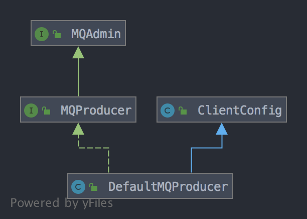

## 如何实现消息发送
rocketmq中发送消息的方式有3种：
### 同步发送
```java
public class SyncProducer {
	public static void main(String[] args) throws Exception {
    	// 实例化消息生产者Producer
        DefaultMQProducer producer = new DefaultMQProducer("please_rename_unique_group_name");
    	// 设置NameServer的地址
    	producer.setNamesrvAddr("localhost:9876");
    	// 启动Producer实例
      producer.start();
    	for (int i = 0; i < 100; i++) {
    	    // 创建消息，并指定Topic，Tag和消息体
    	    Message msg = new Message("TopicTest" /* Topic */,
        	"TagA" /* Tag */,
        	("Hello RocketMQ " + i).getBytes(RemotingHelper.DEFAULT_CHARSET) /* Message body */
        	);
        	// 发送消息到一个Broker
            SendResult sendResult = producer.send(msg);
            // 通过sendResult返回消息是否成功送达
            System.out.printf("%s%n", sendResult);
    	}
    	// 如果不再发送消息，关闭Producer实例。
    	producer.shutdown();
    }
}
```

### 异步发送
```java
public class AsyncProducer {
	public static void main(String[] args) throws Exception {
    	// 实例化消息生产者Producer
        DefaultMQProducer producer = new DefaultMQProducer("please_rename_unique_group_name");
    	// 设置NameServer的地址
        producer.setNamesrvAddr("localhost:9876");
    	// 启动Producer实例
        producer.start();
        producer.setRetryTimesWhenSendAsyncFailed(0);
	
	int messageCount = 100;
        // 根据消息数量实例化倒计时计算器
	final CountDownLatch2 countDownLatch = new CountDownLatch2(messageCount);
    	for (int i = 0; i < messageCount; i++) {
                final int index = i;
            	// 创建消息，并指定Topic，Tag和消息体
                Message msg = new Message("TopicTest",
                    "TagA",
                    "OrderID188",
                    "Hello world".getBytes(RemotingHelper.DEFAULT_CHARSET));
                // SendCallback接收异步返回结果的回调
                producer.send(msg, new SendCallback() {
                    @Override
                    public void onSuccess(SendResult sendResult) {
                        System.out.printf("%-10d OK %s %n", index,
                            sendResult.getMsgId());
                    }
                    @Override
                    public void onException(Throwable e) {
      	              System.out.printf("%-10d Exception %s %n", index, e);
      	              e.printStackTrace();
                    }
            	});
    	}
	// 等待5s
	countDownLatch.await(5, TimeUnit.SECONDS);
    	// 如果不再发送消息，关闭Producer实例。
    	producer.shutdown();
    }
}
```

### 单向发送
```java
public class OnewayProducer {
	public static void main(String[] args) throws Exception{
    	// 实例化消息生产者Producer
        DefaultMQProducer producer = new DefaultMQProducer("please_rename_unique_group_name");
    	// 设置NameServer的地址
        producer.setNamesrvAddr("localhost:9876");
    	// 启动Producer实例
        producer.start();
    	for (int i = 0; i < 100; i++) {
        	// 创建消息，并指定Topic，Tag和消息体
        	Message msg = new Message("TopicTest" /* Topic */,
                "TagA" /* Tag */,
                ("Hello RocketMQ " + i).getBytes(RemotingHelper.DEFAULT_CHARSET) /* Message body */
        	);
        	// 发送单向消息，没有任何返回结果
        	producer.sendOneway(msg);

    	}
    	// 如果不再发送消息，关闭Producer实例。
    	producer.shutdown();
    }
}
```

这三种发送方式的底层实现已经在笔记[remoting模块的作用和实现](../../my_doc/公共组件/remoting模块的作用和实现.md)分析了，这里假设阅读当前文档时已经对[remoting模块的作用和实现](../../my_doc/公共组件/remoting模块的作用和实现.md)有了一定了解，这里关于消息发送的实现分析的关注点在于：
1. 如何获取到路由信息
2. 如何根据路由信息选择broker
3. 发送失败如何处理
4. rocketmq的topic自动创建机制

这里直接从`DefaultMQProducer`的源码开始分析，一边分析一边寻找上面关注点的答案。`DefaultMQProducer`的继承关系如下：



`MQAdmin`接口在笔记[mqadmin命令的实现](../../tools/mqadmin命令的实现.md)中已经介绍了，该接口定义了一些管理rocketmq集群的方法：
```java
public interface MQAdmin {
    void createTopic(final String key, final String newTopic, final int queueNum)
        throws MQClientException;

    void createTopic(String key, String newTopic, int queueNum, int topicSysFlag)
        throws MQClientException;

    long searchOffset(final MessageQueue mq, final long timestamp) throws MQClientException;

    long maxOffset(final MessageQueue mq) throws MQClientException;

    long minOffset(final MessageQueue mq) throws MQClientException;

    long earliestMsgStoreTime(final MessageQueue mq) throws MQClientException;

    MessageExt viewMessage(final String offsetMsgId) throws RemotingException, MQBrokerException,
        InterruptedException, MQClientException;

    QueryResult queryMessage(final String topic, final String key, final int maxNum, final long begin,
        final long end) throws MQClientException, InterruptedException;

    MessageExt viewMessage(String topic,
        String msgId) throws RemotingException, MQBrokerException, InterruptedException, MQClientException;

}
```

上面方法的作用从方法名和方法参数就可以看出来，对于这些方法的实现，在分析代码的过程中如果有需要就分析，这些方法不是当前笔记的关注点。

`MQProducer`接口继承自`MQAdmin`接口，定义了一个生产者需要实现的方法：
```java
public interface MQProducer extends MQAdmin {
    void start() throws MQClientException;

    void shutdown();

    List<MessageQueue> fetchPublishMessageQueues(final String topic) throws MQClientException;

    SendResult send(final Message msg) throws MQClientException, RemotingException, MQBrokerException,
        InterruptedException;

    SendResult send(final Message msg, final long timeout) throws MQClientException,
        RemotingException, MQBrokerException, InterruptedException;

    void send(final Message msg, final SendCallback sendCallback) throws MQClientException,
        RemotingException, InterruptedException;

    void send(final Message msg, final SendCallback sendCallback, final long timeout)
        throws MQClientException, RemotingException, InterruptedException;

    void sendOneway(final Message msg) throws MQClientException, RemotingException,
        InterruptedException;

    SendResult send(final Message msg, final MessageQueue mq) throws MQClientException,
        RemotingException, MQBrokerException, InterruptedException;

    SendResult send(final Message msg, final MessageQueue mq, final long timeout)
        throws MQClientException, RemotingException, MQBrokerException, InterruptedException;

    void send(final Message msg, final MessageQueue mq, final SendCallback sendCallback)
        throws MQClientException, RemotingException, InterruptedException;

    void send(final Message msg, final MessageQueue mq, final SendCallback sendCallback, long timeout)
        throws MQClientException, RemotingException, InterruptedException;

    void sendOneway(final Message msg, final MessageQueue mq) throws MQClientException,
        RemotingException, InterruptedException;

    SendResult send(final Message msg, final MessageQueueSelector selector, final Object arg)
        throws MQClientException, RemotingException, MQBrokerException, InterruptedException;

    SendResult send(final Message msg, final MessageQueueSelector selector, final Object arg,
        final long timeout) throws MQClientException, RemotingException, MQBrokerException,
        InterruptedException;

    void send(final Message msg, final MessageQueueSelector selector, final Object arg,
        final SendCallback sendCallback) throws MQClientException, RemotingException,
        InterruptedException;

    void send(final Message msg, final MessageQueueSelector selector, final Object arg,
        final SendCallback sendCallback, final long timeout) throws MQClientException, RemotingException,
        InterruptedException;

    void sendOneway(final Message msg, final MessageQueueSelector selector, final Object arg)
        throws MQClientException, RemotingException, InterruptedException;

    TransactionSendResult sendMessageInTransaction(final Message msg,
        final LocalTransactionExecuter tranExecuter, final Object arg) throws MQClientException;

    TransactionSendResult sendMessageInTransaction(final Message msg,
        final Object arg) throws MQClientException;

    //for batch
    SendResult send(final Collection<Message> msgs) throws MQClientException, RemotingException, MQBrokerException,
        InterruptedException;

    SendResult send(final Collection<Message> msgs, final long timeout) throws MQClientException,
        RemotingException, MQBrokerException, InterruptedException;

    SendResult send(final Collection<Message> msgs, final MessageQueue mq) throws MQClientException,
        RemotingException, MQBrokerException, InterruptedException;

    SendResult send(final Collection<Message> msgs, final MessageQueue mq, final long timeout)
        throws MQClientException, RemotingException, MQBrokerException, InterruptedException;

    //for rpc
    Message request(final Message msg, final long timeout) throws RequestTimeoutException, MQClientException,
        RemotingException, MQBrokerException, InterruptedException;

    void request(final Message msg, final RequestCallback requestCallback, final long timeout)
        throws MQClientException, RemotingException, InterruptedException, MQBrokerException;

    Message request(final Message msg, final MessageQueueSelector selector, final Object arg,
        final long timeout) throws RequestTimeoutException, MQClientException, RemotingException, MQBrokerException,
        InterruptedException;

    void request(final Message msg, final MessageQueueSelector selector, final Object arg,
        final RequestCallback requestCallback,
        final long timeout) throws MQClientException, RemotingException,
        InterruptedException, MQBrokerException;

    Message request(final Message msg, final MessageQueue mq, final long timeout)
        throws RequestTimeoutException, MQClientException, RemotingException, MQBrokerException, InterruptedException;

    void request(final Message msg, final MessageQueue mq, final RequestCallback requestCallback, long timeout)
        throws MQClientException, RemotingException, MQBrokerException, InterruptedException;
}
```

`ClientConfig`类的作用在笔记[mqadmin命令的实现](../公共组件/mqadmin命令的实现.md)中也已经介绍了，该类定义了rocketmq中作为客户端（包括生产者和消费者）的类可能会用到的属性，如`namesrvAddr`等，通过该类的getter和setter，可以很方便的用spring或直接通过客户端类对象配置或获取客户端的属性。

最后是生产者类：`DefaultMQProducer`，实现了生产者的所有方法。但是`DefaultMQProducer`类的主要作用是继承`ClientConfig`类，方便设置客户端的各种属性，`DefaultMQProducer`类对于`MQProducer`接口的实现，实际上是创建了`DefaultMQProducerImpl`对象来完成的，发送消息的`send()`方法：
```java
@Override
public SendResult send(
    Collection<Message> msgs) throws MQClientException, RemotingException, MQBrokerException, InterruptedException {
    return this.defaultMQProducerImpl.send(batch(msgs));
}
```

所以下面再看`DefaultMQProducerImpl`类的实现。`DefaultMQProducerImpl`类实现了`MQProducerInner`接口，该接口定义了一些供rocketmq内部使用的方法，不过这些方法不是实现消息发送的重点，这里直接看`DefaultMQProducerImpl`类的实现。

当生产者发送消息时，需要先调用`DefaultMQProducer`的`start()`方法，该方法代码如下：
```java
@Override
public void start() throws MQClientException {
    // 将生产者组名设置为namespace%producerGroup的形式
    this.setProducerGroup(withNamespace(this.producerGroup));
    // 初始化DefaultMQProducerImpl，主要是创建并启动MQClientInstance对象
    this.defaultMQProducerImpl.start();
    if (null != traceDispatcher) {
        try {
            traceDispatcher.start(this.getNamesrvAddr(), this.getAccessChannel());
        } catch (MQClientException e) {
            log.warn("trace dispatcher start failed ", e);
        }
    }
}
```

最终调用了`DefaultMQProducerImpl`对象的`start()`方法：
```java
public void start(final boolean startFactory) throws MQClientException {
    switch (this.serviceState) {
        case CREATE_JUST:
            this.serviceState = ServiceState.START_FAILED;

            // 检查生产者组名称的合法性
            this.checkConfig();

            // 如果不是系统内置生产者组，并且instanceName为DEFAULT的情况下，设置instanceName为当前进程的pid
            if (!this.defaultMQProducer.getProducerGroup().equals(MixAll.CLIENT_INNER_PRODUCER_GROUP)) {
                this.defaultMQProducer.changeInstanceNameToPID();
            }

            // 创建MQClientInstance对象
            this.mQClientFactory = MQClientManager.getInstance().getOrCreateMQClientInstance(this.defaultMQProducer, rpcHook);

            // 默认情况下一个进程内的clientId是一样的，所以一个进程内的客户端对象（生产者和消费者）共享一个MQClientInstance对象
            // 这里以当前生产者组名称为key注册当前的DefaultMQProducerImpl对象到MQClientInstance对象，如果当前生产者组名称已经
            // 注册过了则registerOK为false，所以对于默认情况，一个进程内的MQClientInstance对象可能被多个客户端对象持有，通过下
            // 面的注册方式，使得这些客户端对象在他们共享的MQClientInstance对象中以生产者组名/消费者组名为标识被MQClientInstance
            // 对象持有
            boolean registerOK = mQClientFactory.registerProducer(this.defaultMQProducer.getProducerGroup(), this);
            if (!registerOK) {
                // 一个进程内生产者组名称必须唯一，这里在发现已经注册的情况下直接报错
                this.serviceState = ServiceState.CREATE_JUST;
                throw new MQClientException("The producer group[" + this.defaultMQProducer.getProducerGroup()
                    + "] has been created before, specify another name please." + FAQUrl.suggestTodo(FAQUrl.GROUP_NAME_DUPLICATE_URL),
                    null);
            }

            // 添加默认的topic以支持自动创建topic
            this.topicPublishInfoTable.put(this.defaultMQProducer.getCreateTopicKey(), new TopicPublishInfo());

            if (startFactory) {
                // 初始化MQClientInstance对象
                mQClientFactory.start();
            }

            log.info("the producer [{}] start OK. sendMessageWithVIPChannel={}", this.defaultMQProducer.getProducerGroup(),
                this.defaultMQProducer.isSendMessageWithVIPChannel());
            this.serviceState = ServiceState.RUNNING;
            break;
        case RUNNING:
        case START_FAILED:
        case SHUTDOWN_ALREADY:
            throw new MQClientException("The producer service state not OK, maybe started once, "
                + this.serviceState
                + FAQUrl.suggestTodo(FAQUrl.CLIENT_SERVICE_NOT_OK),
                null);
        default:
            break;
    }

    // 向broker发送心跳
    this.mQClientFactory.sendHeartbeatToAllBrokerWithLock();

    // 开启定时任务扫描requestFutureTable中保存的异步的Future，删除过期的并调用回调方法
    this.timer.scheduleAtFixedRate(new TimerTask() {
        @Override
        public void run() {
            try {
                RequestFutureTable.scanExpiredRequest();
            } catch (Throwable e) {
                log.error("scan RequestFutureTable exception", e);
            }
        }
    }, 1000 * 3, 1000);
}
```

在`start()`方法调用之后，就可以发送消息了，demo如下：
```java
for (int i = 0; i < 100; i++) {
    // 创建消息，并指定Topic，Tag和消息体
    Message msg = new Message("TopicTest" /* Topic */,
    "TagA" /* Tag */,
    ("Hello RocketMQ " + i).getBytes(RemotingHelper.DEFAULT_CHARSET) /* Message body */
    );
    // 发送消息到一个Broker
      SendResult sendResult = producer.send(msg);
      // 通过sendResult返回消息是否成功送达
      System.out.printf("%s%n", sendResult);
}
// 如果不再发送消息，关闭Producer实例。
producer.shutdown();
```

`DefaultMQProducer`类的`send()`方法代码如下：
```java
@Override
public SendResult send(
    Message msg) throws MQClientException, RemotingException, MQBrokerException, InterruptedException {
    Validators.checkMessage(msg, this);
    msg.setTopic(withNamespace(msg.getTopic()));
    return this.defaultMQProducerImpl.send(msg);
}
```

`DefaultMQProducer`类只是做了一些必要的校验并设置topic，实际调用的是`DefaultMQProducerImpl`类的`send()`方法：
```java
public SendResult send(
    Message msg) throws MQClientException, RemotingException, MQBrokerException, InterruptedException {
    return send(msg, this.defaultMQProducer.getSendMsgTimeout());
}

public SendResult send(Message msg,
    long timeout) throws MQClientException, RemotingException, MQBrokerException, InterruptedException {
    return this.sendDefaultImpl(msg, CommunicationMode.SYNC, null, timeout);
}

private SendResult sendDefaultImpl(
    Message msg,
    final CommunicationMode communicationMode,
    final SendCallback sendCallback,
    final long timeout
) throws MQClientException, RemotingException, MQBrokerException, InterruptedException {
    this.makeSureStateOK();
    Validators.checkMessage(msg, this.defaultMQProducer);
    final long invokeID = random.nextLong();
    // 记录开始时间
    long beginTimestampFirst = System.currentTimeMillis();
    // 由于有重试机制，所以还需要一个字段记录上一次开始时间
    long beginTimestampPrev = beginTimestampFirst;
    long endTimestamp = beginTimestampFirst;
    // TopicPublishInfo包含了从namesrv查询到的topic对应的MessageQueue，所以TopicPublishInfo对象相当于topic的路由信息
    TopicPublishInfo topicPublishInfo = this.tryToFindTopicPublishInfo(msg.getTopic());
    // 如果messageQueue列表不为空就表示当前获取到的路由信息可用
    if (topicPublishInfo != null && topicPublishInfo.ok()) {
        boolean callTimeout = false;
        MessageQueue mq = null;
        Exception exception = null;
        SendResult sendResult = null;
        // 获取发送失败时的重试次数
        int timesTotal = communicationMode == CommunicationMode.SYNC ? 1 + this.defaultMQProducer.getRetryTimesWhenSendFailed() : 1;
        int times = 0;
        String[] brokersSent = new String[timesTotal];
        for (; times < timesTotal; times++) {
            String lastBrokerName = null == mq ? null : mq.getBrokerName();
            // 使用MQFaultStrategy选择一个队列，默认轮询所有的队列
            MessageQueue mqSelected = this.selectOneMessageQueue(topicPublishInfo, lastBrokerName);
            if (mqSelected != null) {
                mq = mqSelected;
                // 保存这一次选择的broker的名字
                brokersSent[times] = mq.getBrokerName();
                try {
                    // 记录这次的开始时间
                    beginTimestampPrev = System.currentTimeMillis();
                    if (times > 0) {
                        //Reset topic with namespace during resend.
                        msg.setTopic(this.defaultMQProducer.withNamespace(msg.getTopic()));
                    }
                    // 判断是否超时
                    long costTime = beginTimestampPrev - beginTimestampFirst;
                    if (timeout < costTime) {
                        callTimeout = true;
                        break;
                    }

                    // 发送消息到指定队列
                    sendResult = this.sendKernelImpl(msg, mq, communicationMode, sendCallback, topicPublishInfo, timeout - costTime);
                    endTimestamp = System.currentTimeMillis();
                    this.updateFaultItem(mq.getBrokerName(), endTimestamp - beginTimestampPrev, false);
                    switch (communicationMode) {
                        case ASYNC:
                            return null;
                        case ONEWAY:
                            return null;
                        case SYNC:
                            // 如果sendResult不是SEND_OK说明broker收到请求了并且也做出了响应，但是由于某些原因，如系统繁忙，拒绝
                            // 保存接收消息，此时通过retryAnotherBrokerWhenNotStoreOK配置判断是否需要换一个broker再发送，如果
                            // 不需要则直接返回结果即可
                            if (sendResult.getSendStatus() != SendStatus.SEND_OK) {
                                if (this.defaultMQProducer.isRetryAnotherBrokerWhenNotStoreOK()) {
                                    continue;
                                }
                            }

                            return sendResult;
                        default:
                            break;
                    }
                } catch (RemotingException e) {
                    endTimestamp = System.currentTimeMillis();
                    this.updateFaultItem(mq.getBrokerName(), endTimestamp - beginTimestampPrev, true);
                    log.warn(String.format("sendKernelImpl exception, resend at once, InvokeID: %s, RT: %sms, Broker: %s", invokeID, endTimestamp - beginTimestampPrev, mq), e);
                    log.warn(msg.toString());
                    exception = e;
                    continue;
                } catch (MQClientException e) {
                    endTimestamp = System.currentTimeMillis();
                    this.updateFaultItem(mq.getBrokerName(), endTimestamp - beginTimestampPrev, true);
                    log.warn(String.format("sendKernelImpl exception, resend at once, InvokeID: %s, RT: %sms, Broker: %s", invokeID, endTimestamp - beginTimestampPrev, mq), e);
                    log.warn(msg.toString());
                    exception = e;
                    continue;
                } catch (MQBrokerException e) {
                    endTimestamp = System.currentTimeMillis();
                    this.updateFaultItem(mq.getBrokerName(), endTimestamp - beginTimestampPrev, true);
                    log.warn(String.format("sendKernelImpl exception, resend at once, InvokeID: %s, RT: %sms, Broker: %s", invokeID, endTimestamp - beginTimestampPrev, mq), e);
                    log.warn(msg.toString());
                    exception = e;
                    switch (e.getResponseCode()) {
                        case ResponseCode.TOPIC_NOT_EXIST:
                        case ResponseCode.SERVICE_NOT_AVAILABLE:
                        case ResponseCode.SYSTEM_ERROR:
                        case ResponseCode.NO_PERMISSION:
                        case ResponseCode.NO_BUYER_ID:
                        case ResponseCode.NOT_IN_CURRENT_UNIT:
                            continue;
                        default:
                            if (sendResult != null) {
                                return sendResult;
                            }

                            throw e;
                    }
                } catch (InterruptedException e) {
                    endTimestamp = System.currentTimeMillis();
                    this.updateFaultItem(mq.getBrokerName(), endTimestamp - beginTimestampPrev, false);
                    log.warn(String.format("sendKernelImpl exception, throw exception, InvokeID: %s, RT: %sms, Broker: %s", invokeID, endTimestamp - beginTimestampPrev, mq), e);
                    log.warn(msg.toString());

                    log.warn("sendKernelImpl exception", e);
                    log.warn(msg.toString());
                    throw e;
                }
            } else {
                break;
            }
        }

        if (sendResult != null) {
            return sendResult;
        }

        // 发送失败时记录日志
        String info = String.format("Send [%d] times, still failed, cost [%d]ms, Topic: %s, BrokersSent: %s",
            times,
            System.currentTimeMillis() - beginTimestampFirst,
            msg.getTopic(),
            Arrays.toString(brokersSent));

        info += FAQUrl.suggestTodo(FAQUrl.SEND_MSG_FAILED);

        MQClientException mqClientException = new MQClientException(info, exception);
        if (callTimeout) {
            throw new RemotingTooMuchRequestException("sendDefaultImpl call timeout");
        }

        if (exception instanceof MQBrokerException) {
            mqClientException.setResponseCode(((MQBrokerException) exception).getResponseCode());
        } else if (exception instanceof RemotingConnectException) {
            mqClientException.setResponseCode(ClientErrorCode.CONNECT_BROKER_EXCEPTION);
        } else if (exception instanceof RemotingTimeoutException) {
            mqClientException.setResponseCode(ClientErrorCode.ACCESS_BROKER_TIMEOUT);
        } else if (exception instanceof MQClientException) {
            mqClientException.setResponseCode(ClientErrorCode.BROKER_NOT_EXIST_EXCEPTION);
        }

        throw mqClientException;
    }

    // 判断可用的namesrv地址列表是否为空
    validateNameServerSetting();

    throw new MQClientException("No route info of this topic: " + msg.getTopic() + FAQUrl.suggestTodo(FAQUrl.NO_TOPIC_ROUTE_INFO),
        null).setResponseCode(ClientErrorCode.NOT_FOUND_TOPIC_EXCEPTION);
}
```

顺着调用链最终执行了`sendDefaultImpl()`方法，该方法执行了真正发送消息的逻辑。发送消息前首先需要获取路由信息，执行的方法是：`this.tryToFindTopicPublishInfo(msg.getTopic());`，该方法代码如下：
```java
private TopicPublishInfo tryToFindTopicPublishInfo(final String topic) {
    TopicPublishInfo topicPublishInfo = this.topicPublishInfoTable.get(topic);
    // 当缓存中没有topic时
    if (null == topicPublishInfo || !topicPublishInfo.ok()) {
        // 先在缓存中放一个默认值
        this.topicPublishInfoTable.putIfAbsent(topic, new TopicPublishInfo());
        // 从namesrv获取topic配置，如果未发现topic对应的broker，则只会记自日志
        this.mQClientFactory.updateTopicRouteInfoFromNameServer(topic);
        // 如果获取topic配置成功则这里获取到的就是对应的配置，否则是上面添加的默认值
        topicPublishInfo = this.topicPublishInfoTable.get(topic);
    }

    // 如果haveTopicRouterInfo为true则表示该topicPublishInfo是从TopicRouteData对象解析而来的
    // haveTopicRouterInfo为true时topicPublishInfo的messageQueueList也可能为空，也就是对应的路由信息中不存在可用队列，可以看
    // updateTopicRouteInfoFromNameServer方法创建TopicPublishInfo的过程
    // 如果topicPublishInfo.ok()为true则表示该topicPublishInfo对象有对应的队列，可以使用
    if (topicPublishInfo.isHaveTopicRouterInfo() || topicPublishInfo.ok()) {
        return topicPublishInfo;
    } else {
        // 如果topicPublishInfo不能用，则以MixAll.AUTO_CREATE_TOPIC_KEY_TOPIC对应的topic配置为当前topic配置，使得在namesrv
        // 中没有找到指定的topic时使用MixAll.AUTO_CREATE_TOPIC_KEY_TOPIC的配置，关于这块的描述，可以看AbstractSendMessageProcessor
        // 类的msgCheck方法
        this.mQClientFactory.updateTopicRouteInfoFromNameServer(topic, true, this.defaultMQProducer);
        topicPublishInfo = this.topicPublishInfoTable.get(topic);
        return topicPublishInfo;
    }
}
```

`tryToFindTopicPublishInfo()`方法首先从缓存中获取`TopicPublishInfo`对象，该对象包含了某个topic的路由信息（实际上还需要根据`MQClientInstance`对象的`brokerAddrTable`属性获取broker的地址），`TopicPublishInfo`类定义如下：
```java
public class TopicPublishInfo {
    // 该属性的作用可以看MQClientInstance类的topicRouteData2TopicPublishInfo方法
    private boolean orderTopic = false;
    // 当前TopicPublishInfo对象是否从TopicRouteData对象创建而来
    private boolean haveTopicRouterInfo = false;
    // 从路由信息，即TopicRouteData对象的QueueData的writeQueueNums属性，创建的对应数量的队列
    private List<MessageQueue> messageQueueList = new ArrayList<MessageQueue>();
    private volatile ThreadLocalIndex sendWhichQueue = new ThreadLocalIndex();
    // 当前TopicPublishInfo对象对应的路由信息
    private TopicRouteData topicRouteData;

    public boolean isOrderTopic() {
        return orderTopic;
    }

    public void setOrderTopic(boolean orderTopic) {
        this.orderTopic = orderTopic;
    }

    public boolean ok() {
        return null != this.messageQueueList && !this.messageQueueList.isEmpty();
    }

    public List<MessageQueue> getMessageQueueList() {
        return messageQueueList;
    }

    public void setMessageQueueList(List<MessageQueue> messageQueueList) {
        this.messageQueueList = messageQueueList;
    }

    public ThreadLocalIndex getSendWhichQueue() {
        return sendWhichQueue;
    }

    public void setSendWhichQueue(ThreadLocalIndex sendWhichQueue) {
        this.sendWhichQueue = sendWhichQueue;
    }

    public boolean isHaveTopicRouterInfo() {
        return haveTopicRouterInfo;
    }

    public void setHaveTopicRouterInfo(boolean haveTopicRouterInfo) {
        this.haveTopicRouterInfo = haveTopicRouterInfo;
    }

    public MessageQueue selectOneMessageQueue(final String lastBrokerName) {
        if (lastBrokerName == null) {
            return selectOneMessageQueue();
        } else {
            int index = this.sendWhichQueue.getAndIncrement();
            for (int i = 0; i < this.messageQueueList.size(); i++) {
                int pos = Math.abs(index++) % this.messageQueueList.size();
                if (pos < 0)
                    pos = 0;
                MessageQueue mq = this.messageQueueList.get(pos);
                if (!mq.getBrokerName().equals(lastBrokerName)) {
                    return mq;
                }
            }
            return selectOneMessageQueue();
        }
    }

    public MessageQueue selectOneMessageQueue() {
        int index = this.sendWhichQueue.getAndIncrement();
        int pos = Math.abs(index) % this.messageQueueList.size();
        if (pos < 0)
            pos = 0;
        return this.messageQueueList.get(pos);
    }

    public int getQueueIdByBroker(final String brokerName) {
        for (int i = 0; i < topicRouteData.getQueueDatas().size(); i++) {
            final QueueData queueData = this.topicRouteData.getQueueDatas().get(i);
            if (queueData.getBrokerName().equals(brokerName)) {
                return queueData.getWriteQueueNums();
            }
        }

        return -1;
    }

    @Override
    public String toString() {
        return "TopicPublishInfo [orderTopic=" + orderTopic + ", messageQueueList=" + messageQueueList
            + ", sendWhichQueue=" + sendWhichQueue + ", haveTopicRouterInfo=" + haveTopicRouterInfo + "]";
    }

    public TopicRouteData getTopicRouteData() {
        return topicRouteData;
    }

    public void setTopicRouteData(final TopicRouteData topicRouteData) {
        this.topicRouteData = topicRouteData;
    }
}
```

每个topic可以存在于多个broker中，每个topic在broker中都有相应的配置，配置中最重要的是topic在broker中的队列数量。当生产者发送消息时，实际上是将消息发送给某个broker下的队列，所以消费者需要知道所有broker中topic的信息，特别是队列信息。这些信息实际上就是`TopicPublishInfo`类中的`MessageQueue`对象列表，该类定义如下：
```java
public class MessageQueue implements Comparable<MessageQueue>, Serializable {
    private static final long serialVersionUID = 6191200464116433425L;
    private String topic;
    private String brokerName;
    // 队列id只是在根据QueueData的writeQueueNums属性创建MessageQueue时的序号
    private int queueId;

    // 略
```

当`tryToFindTopicPublishInfo()`方法从缓存中获取路由信息失败后，需要从namesrv中获取最新的路由信息，对应的语句是`this.mQClientFactory.updateTopicRouteInfoFromNameServer(topic);`。该方法代码如下：
```java
public boolean updateTopicRouteInfoFromNameServer(final String topic) {
    return updateTopicRouteInfoFromNameServer(topic, false, null);
}

public boolean updateTopicRouteInfoFromNameServer(final String topic, boolean isDefault,
    DefaultMQProducer defaultMQProducer) {
    try {
        if (this.lockNamesrv.tryLock(LOCK_TIMEOUT_MILLIS, TimeUnit.MILLISECONDS)) {
            try {
                TopicRouteData topicRouteData;
                // isDefault为true并且defaultMQProducer不为空时，表示可以使用默认的topic，以此支持自动创建topic
                if (isDefault && defaultMQProducer != null) {
                    // 获取默认topic的路由信息
                    topicRouteData = this.mQClientAPIImpl.getDefaultTopicRouteInfoFromNameServer(defaultMQProducer.getCreateTopicKey(),
                        1000 * 3);
                    if (topicRouteData != null) {
                        for (QueueData data : topicRouteData.getQueueDatas()) {
                            int queueNums = Math.min(defaultMQProducer.getDefaultTopicQueueNums(), data.getReadQueueNums());
                            data.setReadQueueNums(queueNums);
                            data.setWriteQueueNums(queueNums);
                        }
                    }
                } else {
                    // 如果不使用默认topic，则获取当前topic的路由信息
                    topicRouteData = this.mQClientAPIImpl.getTopicRouteInfoFromNameServer(topic, 1000 * 3);
                }
                if (topicRouteData != null) {
                    TopicRouteData old = this.topicRouteTable.get(topic);
                    // 判断新获取到的路由信息和之前的路由信息是否有变化
                    boolean changed = topicRouteDataIsChange(old, topicRouteData);
                    if (!changed) {
                        // 对于生产者，调用DefaultMQProducerImpl的isPublishTopicNeedUpdate方法，判断老的路由信息中的队列是否
                        // 为空
                        changed = this.isNeedUpdateTopicRouteInfo(topic);
                    } else {
                        log.info("the topic[{}] route info changed, old[{}] ,new[{}]", topic, old, topicRouteData);
                    }

                    if (changed) {
                        TopicRouteData cloneTopicRouteData = topicRouteData.cloneTopicRouteData();

                        // 根据最新的路由信息更新broker地址
                        for (BrokerData bd : topicRouteData.getBrokerDatas()) {
                            this.brokerAddrTable.put(bd.getBrokerName(), bd.getBrokerAddrs());
                        }

                        // Update Pub info
                        {
                            // 遍历当前topicRouteData对象的QueueData，为每个QueueData对象创建writeQueueNums个MessageQueue对象，
                            // 并保存到TopicPublishInfo对象中，即TopicPublishInfo对象包含了所有可写队列对应的MessageQueue对象
                            TopicPublishInfo publishInfo = topicRouteData2TopicPublishInfo(topic, topicRouteData);
                            publishInfo.setHaveTopicRouterInfo(true);
                            Iterator<Entry<String, MQProducerInner>> it = this.producerTable.entrySet().iterator();
                            while (it.hasNext()) {
                                Entry<String, MQProducerInner> entry = it.next();
                                MQProducerInner impl = entry.getValue();
                                if (impl != null) {
                                    // 将关联关系更新到topicPublishInfoTable
                                    impl.updateTopicPublishInfo(topic, publishInfo);
                                }
                            }
                        }

                        // Update sub info
                        {
                            // subscribeInfo对象包含了所有可读队列对应的MessageQueue对象
                            Set<MessageQueue> subscribeInfo = topicRouteData2TopicSubscribeInfo(topic, topicRouteData);
                            Iterator<Entry<String, MQConsumerInner>> it = this.consumerTable.entrySet().iterator();
                            while (it.hasNext()) {
                                Entry<String, MQConsumerInner> entry = it.next();
                                MQConsumerInner impl = entry.getValue();
                                if (impl != null) {
                                    // 将关联关系更新到MQConsumerInner对象的RebalancePushImpl对象的topicSubscribeInfoTable
                                    // 属性中
                                    impl.updateTopicSubscribeInfo(topic, subscribeInfo);
                                }
                            }
                        }
                        log.info("topicRouteTable.put. Topic = {}, TopicRouteData[{}]", topic, cloneTopicRouteData);
                        // 保存最新的路由信息
                        this.topicRouteTable.put(topic, cloneTopicRouteData);
                        return true;
                    }
                } else {
                    log.warn("updateTopicRouteInfoFromNameServer, getTopicRouteInfoFromNameServer return null, Topic: {}", topic);
                }
            } catch (MQClientException e) {
                if (!topic.startsWith(MixAll.RETRY_GROUP_TOPIC_PREFIX) && !topic.equals(MixAll.AUTO_CREATE_TOPIC_KEY_TOPIC)) {
                    log.warn("updateTopicRouteInfoFromNameServer Exception", e);
                }
            } catch (RemotingException e) {
                log.error("updateTopicRouteInfoFromNameServer Exception", e);
                throw new IllegalStateException(e);
            } finally {
                this.lockNamesrv.unlock();
            }
        } else {
            log.warn("updateTopicRouteInfoFromNameServer tryLock timeout {}ms", LOCK_TIMEOUT_MILLIS);
        }
    } catch (InterruptedException e) {
        log.warn("updateTopicRouteInfoFromNameServer Exception", e);
    }

    return false;
}
```

`updateTopicRouteInfoFromNameServer()`方法首先判断了`isDefault`参数和`defaultMQProducer`对象，和rocketmq中自动创建topic的机制有关，这里先不分析，后面再说，这里先看正常逻辑。

更新路由信息的第一步是向namesrv发送获取路由信息的请求，对应的语句是：`this.mQClientAPIImpl.getTopicRouteInfoFromNameServer(topic, 1000 * 3);`，即`MQClientAPIImpl`类的`getTopicRouteInfoFromNameServer()`方法，这里先看下该方法的返回值`TopicRouteData`类的代码：
```java
public class TopicRouteData extends RemotingSerializable {
    private String orderTopicConf;
    // QueueData保存有brokerName及当前topic在该broker下的队列配置
    private List<QueueData> queueDatas;
    // BrokerData保存有所有和当前topic相关的brokerName、brokerId和brokerAddr
    private List<BrokerData> brokerDatas;
    private HashMap<String/* brokerAddr */, List<String>/* Filter Server */> filterServerTable;

    // 略
}
```

`TopicRouteData`类包含了一个topic在所有broker中的配置，属性中的`QueueData`对象保存有brokerName及当前topic在该broker下的队列和权限配置，而`BrokerData`对象保存了所有和当前topic相关的broker的brokerName和brokerAddr等信息。下面来看`MQClientAPIImpl`类的`getTopicRouteInfoFromNameServer()`方法返回`TopicRouteData`对象的过程。`getTopicRouteInfoFromNameServer()`方法并没有什么复杂逻辑，只是向namesrv发送了一个请求code为`RequestCode.GET_ROUTEINTO_BY_TOPIC`的同步请求来获取`TopicRouteData`对象，`getTopicRouteInfoFromNameServer()`方法代码如下：
```java
public TopicRouteData getTopicRouteInfoFromNameServer(final String topic, final long timeoutMillis)
    throws RemotingException, MQClientException, InterruptedException {

    return getTopicRouteInfoFromNameServer(topic, timeoutMillis, true);
}

public TopicRouteData getTopicRouteInfoFromNameServer(final String topic, final long timeoutMillis,
    boolean allowTopicNotExist) throws MQClientException, InterruptedException, RemotingTimeoutException, RemotingSendRequestException, RemotingConnectException {
    GetRouteInfoRequestHeader requestHeader = new GetRouteInfoRequestHeader();
    requestHeader.setTopic(topic);

    RemotingCommand request = RemotingCommand.createRequestCommand(RequestCode.GET_ROUTEINTO_BY_TOPIC, requestHeader);

    RemotingCommand response = this.remotingClient.invokeSync(null, request, timeoutMillis);
    assert response != null;
    switch (response.getCode()) {
        case ResponseCode.TOPIC_NOT_EXIST: {
            if (allowTopicNotExist && !topic.equals(MixAll.AUTO_CREATE_TOPIC_KEY_TOPIC)) {
                log.warn("get Topic [{}] RouteInfoFromNameServer is not exist value", topic);
            }

            break;
        }
        case ResponseCode.SUCCESS: {
            byte[] body = response.getBody();
            if (body != null) {
                return TopicRouteData.decode(body, TopicRouteData.class);
            }
        }
        default:
            break;
    }

    throw new MQClientException(response.getCode(), response.getRemark());
}
```

从笔记[Namesrv的实现](../../namesrv/README.md)可以看出namesrv对`RequestCode.GET_ROUTEINTO_BY_TOPIC`请求的处理过程，该请求对应的处理方法是`DefaultRequestProcessor`类的`getRouteInfoByTopic()`方法，处理过程这里不再赘述，这里只放下该方法代码：
```java
public RemotingCommand getRouteInfoByTopic(ChannelHandlerContext ctx,
    RemotingCommand request) throws RemotingCommandException {
    final RemotingCommand response = RemotingCommand.createResponseCommand(null);
    final GetRouteInfoRequestHeader requestHeader =
        (GetRouteInfoRequestHeader) request.decodeCommandCustomHeader(GetRouteInfoRequestHeader.class);

    TopicRouteData topicRouteData = this.namesrvController.getRouteInfoManager().pickupTopicRouteData(requestHeader.getTopic());

    if (topicRouteData != null) {
        if (this.namesrvController.getNamesrvConfig().isOrderMessageEnable()) {
            String orderTopicConf =
                this.namesrvController.getKvConfigManager().getKVConfig(NamesrvUtil.NAMESPACE_ORDER_TOPIC_CONFIG,
                    requestHeader.getTopic());
            topicRouteData.setOrderTopicConf(orderTopicConf);
        }

        byte[] content = topicRouteData.encode();
        response.setBody(content);
        response.setCode(ResponseCode.SUCCESS);
        response.setRemark(null);
        return response;
    }

    response.setCode(ResponseCode.TOPIC_NOT_EXIST);
    response.setRemark("No topic route info in name server for the topic: " + requestHeader.getTopic()
        + FAQUrl.suggestTodo(FAQUrl.APPLY_TOPIC_URL));
    return response;
}

```

回到`MQClientInstance`对象的`updateTopicRouteInfoFromNameServer()`方法，从namesrv获取到`TopicRouteData`对象后，后面的逻辑是根据该对象构建`TopicPublishInfo`对象，主要逻辑如下：
```java
TopicRouteData cloneTopicRouteData = topicRouteData.cloneTopicRouteData();

// 根据最新的路由信息更新broker地址
for (BrokerData bd : topicRouteData.getBrokerDatas()) {
    this.brokerAddrTable.put(bd.getBrokerName(), bd.getBrokerAddrs());
}

// Update Pub info
{
    // 遍历当前topicRouteData对象的QueueData，为每个QueueData对象创建writeQueueNums个MessageQueue对象，
    // 并保存到TopicPublishInfo对象中，即TopicPublishInfo对象包含了所有可写队列对应的MessageQueue对象
    TopicPublishInfo publishInfo = topicRouteData2TopicPublishInfo(topic, topicRouteData);
    // 标记当前TopicPublishInfo对象是从TopicRouteData对象创建而来
    publishInfo.setHaveTopicRouterInfo(true);
    Iterator<Entry<String, MQProducerInner>> it = this.producerTable.entrySet().iterator();
    while (it.hasNext()) {
        Entry<String, MQProducerInner> entry = it.next();
        MQProducerInner impl = entry.getValue();
        if (impl != null) {
            // 将关联关系更新到topicPublishInfoTable
            impl.updateTopicPublishInfo(topic, publishInfo);
        }
    }
}

// Update sub info
{
    // subscribeInfo对象包含了所有可读队列对应的MessageQueue对象
    Set<MessageQueue> subscribeInfo = topicRouteData2TopicSubscribeInfo(topic, topicRouteData);
    Iterator<Entry<String, MQConsumerInner>> it = this.consumerTable.entrySet().iterator();
    while (it.hasNext()) {
        Entry<String, MQConsumerInner> entry = it.next();
        MQConsumerInner impl = entry.getValue();
        if (impl != null) {
            // 将关联关系更新到MQConsumerInner对象的RebalancePushImpl对象的topicSubscribeInfoTable
            // 属性中
            impl.updateTopicSubscribeInfo(topic, subscribeInfo);
        }
    }
}
log.info("topicRouteTable.put. Topic = {}, TopicRouteData[{}]", topic, cloneTopicRouteData);
// 保存最新的路由信息
this.topicRouteTable.put(topic, cloneTopicRouteData);
return true;
```

上面的逻辑并不复杂，重点在于创建`TopicPublishInfo`对象的`topicRouteData2TopicPublishInfo()`方法，该方法代码如下：
```java
public static TopicPublishInfo topicRouteData2TopicPublishInfo(final String topic, final TopicRouteData route) {
    TopicPublishInfo info = new TopicPublishInfo();
    info.setTopicRouteData(route);
    if (route.getOrderTopicConf() != null && route.getOrderTopicConf().length() > 0) {
        // 根据下面的代码可以看出，orderTopic的作用是在路由信息中使用orderTopicConf表示各个broker的权重，以
        // broker1Name:num;broker2Name:num...的形式指定多个broker及broker的队列数量，而不是直接用QueueData
        // 对象的writeQueueNums属性
        String[] brokers = route.getOrderTopicConf().split(";");
        for (String broker : brokers) {
            String[] item = broker.split(":");
            int nums = Integer.parseInt(item[1]);
            for (int i = 0; i < nums; i++) {
                MessageQueue mq = new MessageQueue(topic, item[0], i);
                info.getMessageQueueList().add(mq);
            }
        }

        info.setOrderTopic(true);
    } else {
        // 遍历所有的队列，每个队列创建writeQueueNums个MessageQueue对象并添加到TopicPublishInfo中
        List<QueueData> qds = route.getQueueDatas();
        Collections.sort(qds);
        for (QueueData qd : qds) {
            if (PermName.isWriteable(qd.getPerm())) {
                BrokerData brokerData = null;
                for (BrokerData bd : route.getBrokerDatas()) {
                    if (bd.getBrokerName().equals(qd.getBrokerName())) {
                        brokerData = bd;
                        break;
                    }
                }

                if (null == brokerData) {
                    continue;
                }

                // 当队列的brokerName对应的多个broker不包含master broker，则不创建响应的MessageQueue，因为非master broker不能
                // 保存消息
                if (!brokerData.getBrokerAddrs().containsKey(MixAll.MASTER_ID)) {
                    continue;
                }

                for (int i = 0; i < qd.getWriteQueueNums(); i++) {
                    MessageQueue mq = new MessageQueue(topic, qd.getBrokerName(), i);
                    info.getMessageQueueList().add(mq);
                }
            }
        }

        info.setOrderTopic(false);
    }

    return info;
}
```

代码的实现如注释所说，这里不再赘述。以上是获取路由信息的过程，`MQClientInstance`类的`updateTopicRouteInfoFromNameServer()`方法分析完了，回到`DefaultMQProducerImpl`类的`tryToFindTopicPublishInfo()`方法：
```java
private TopicPublishInfo tryToFindTopicPublishInfo(final String topic) {
    TopicPublishInfo topicPublishInfo = this.topicPublishInfoTable.get(topic);
    // 当缓存中没有topic时
    if (null == topicPublishInfo || !topicPublishInfo.ok()) {
        // 先在缓存中放一个默认值
        this.topicPublishInfoTable.putIfAbsent(topic, new TopicPublishInfo());
        // 从namesrv获取topic配置，如果未发现topic对应的broker，则只会记自日志
        this.mQClientFactory.updateTopicRouteInfoFromNameServer(topic);
        // 如果获取topic配置成功则这里获取到的就是对应的配置，否则是上面添加的默认值
        topicPublishInfo = this.topicPublishInfoTable.get(topic);
    }

    // 如果haveTopicRouterInfo为true则表示该topicPublishInfo是从TopicRouteData对象解析而来的
    // haveTopicRouterInfo为true时topicPublishInfo的messageQueueList也可能为空，也就是对应的路由信息中不存在可用队列，可以看
    // updateTopicRouteInfoFromNameServer方法创建TopicPublishInfo的过程
    // 如果topicPublishInfo.ok()为true则表示该topicPublishInfo对象有对应的队列，可以使用
    if (topicPublishInfo.isHaveTopicRouterInfo() || topicPublishInfo.ok()) {
        return topicPublishInfo;
    } else {
        // 如果topicPublishInfo不能用，则以MixAll.AUTO_CREATE_TOPIC_KEY_TOPIC对应的topic配置为当前topic配置，使得在namesrv
        // 中没有找到指定的topic时使用MixAll.AUTO_CREATE_TOPIC_KEY_TOPIC的配置，关于这块的描述，可以看AbstractSendMessageProcessor
        // 类的msgCheck方法
        this.mQClientFactory.updateTopicRouteInfoFromNameServer(topic, true, this.defaultMQProducer);
        topicPublishInfo = this.topicPublishInfoTable.get(topic);
        return topicPublishInfo;
    }
}
```

在`updateTopicRouteInfoFromNameServer()`方法执行完后，就可以从缓存中获取到最新的路由信息了，之后就可以直接返回了，再回到`DefaultMQProducerImpl`对象的`sendDefaultImpl()`方法，获取到路由信息后就可以开始发送消息了，代码如下：
```java
if (topicPublishInfo != null && topicPublishInfo.ok()) {
    boolean callTimeout = false;
    MessageQueue mq = null;
    Exception exception = null;
    SendResult sendResult = null;
    // 获取发送失败时的重试次数
    int timesTotal = communicationMode == CommunicationMode.SYNC ? 1 + this.defaultMQProducer.getRetryTimesWhenSendFailed() : 1;
    int times = 0;
    String[] brokersSent = new String[timesTotal];
    for (; times < timesTotal; times++) {
        String lastBrokerName = null == mq ? null : mq.getBrokerName();
        // 使用MQFaultStrategy选择一个队列，默认轮询所有的队列
        MessageQueue mqSelected = this.selectOneMessageQueue(topicPublishInfo, lastBrokerName);
        if (mqSelected != null) {
            mq = mqSelected;
            // 保存这一次选择的broker的名字
            brokersSent[times] = mq.getBrokerName();
            try {
                // 记录这次的开始时间
                beginTimestampPrev = System.currentTimeMillis();
                if (times > 0) {
                    //Reset topic with namespace during resend.
                    msg.setTopic(this.defaultMQProducer.withNamespace(msg.getTopic()));
                }
                // 判断是否超时
                long costTime = beginTimestampPrev - beginTimestampFirst;
                if (timeout < costTime) {
                    callTimeout = true;
                    break;
                }

                // 发送消息到指定队列
                sendResult = this.sendKernelImpl(msg, mq, communicationMode, sendCallback, topicPublishInfo, timeout - costTime);
                endTimestamp = System.currentTimeMillis();
                this.updateFaultItem(mq.getBrokerName(), endTimestamp - beginTimestampPrev, false);
                switch (communicationMode) {
                    case ASYNC:
                        return null;
                    case ONEWAY:
                        return null;
                    case SYNC:
                        // 如果sendResult不是SEND_OK说明broker收到请求了并且也做出了响应，但是由于某些原因，如系统繁忙，拒绝
                        // 保存接收消息，此时通过retryAnotherBrokerWhenNotStoreOK配置判断是否需要换一个broker再发送，如果
                        // 不需要则直接返回结果即可
                        if (sendResult.getSendStatus() != SendStatus.SEND_OK) {
                            if (this.defaultMQProducer.isRetryAnotherBrokerWhenNotStoreOK()) {
                                continue;
                            }
                        }

                        return sendResult;
                    default:
                        break;
                }
            } catch (RemotingException e) {
                // 略
            }
        } else {
            break;
        }
    }

    if (sendResult != null) {
        return sendResult;
    }

    // 略
}
```

首先执行的逻辑是选择一个队列进行发送，对应的方法为`selectOneMessageQueue()`，选择过程在笔记[如何实现负载均衡](如何实现负载均衡.md)中有介绍，这里不再赘述。在选出队列后执行发送的方法是`sendKernelImpl()`方法，该方法代码如下：
```java
private SendResult sendKernelImpl(final Message msg,
    final MessageQueue mq,
    final CommunicationMode communicationMode,
    final SendCallback sendCallback,
    final TopicPublishInfo topicPublishInfo,
    final long timeout) throws MQClientException, RemotingException, MQBrokerException, InterruptedException {
    long beginStartTime = System.currentTimeMillis();
    // 获取brokerName对应的master broker的地址
    String brokerAddr = this.mQClientFactory.findBrokerAddressInPublish(mq.getBrokerName());
    if (null == brokerAddr) {
        // 如果为空则更新路由信息，再获取一次地址
        tryToFindTopicPublishInfo(mq.getTopic());
        brokerAddr = this.mQClientFactory.findBrokerAddressInPublish(mq.getBrokerName());
    }

    SendMessageContext context = null;
    if (brokerAddr != null) {
        // 如果vipChannelEnabled为true，将端口改为10909而不是原先的10911，这就是vip channel，每个broker都有一个对应的
        // vip remote server，也就是fastRemotingServer
        brokerAddr = MixAll.brokerVIPChannel(this.defaultMQProducer.isSendMessageWithVIPChannel(), brokerAddr);

        // 获取消息体
        byte[] prevBody = msg.getBody();
        try {
            //for MessageBatch,ID has been set in the generating process
            if (!(msg instanceof MessageBatch)) {
                // 如果不是批量消息，并且当前Message对象的属性列表中的UNIQ_KEY属性为空，则添加一个该属性，属性值为根据时间戳、
                // ip、counter等信息计算的字符串
                MessageClientIDSetter.setUniqID(msg);
            }

            boolean topicWithNamespace = false;
            // 设置namespace到instanceId
            if (null != this.mQClientFactory.getClientConfig().getNamespace()) {
                msg.setInstanceId(this.mQClientFactory.getClientConfig().getNamespace());
                topicWithNamespace = true;
            }

            int sysFlag = 0;
            boolean msgBodyCompressed = false;
            if (this.tryToCompressMessage(msg)) {
                // 添加压缩表示
                sysFlag |= MessageSysFlag.COMPRESSED_FLAG;
                msgBodyCompressed = true;
            }

            // 如果是事务消息，则添加相关标识
            final String tranMsg = msg.getProperty(MessageConst.PROPERTY_TRANSACTION_PREPARED);
            if (tranMsg != null && Boolean.parseBoolean(tranMsg)) {
                sysFlag |= MessageSysFlag.TRANSACTION_PREPARED_TYPE;
            }

            // 如果存在CheckForbiddenHook，则遍历并调用checkForbidden方法
            if (hasCheckForbiddenHook()) {
                CheckForbiddenContext checkForbiddenContext = new CheckForbiddenContext();
                checkForbiddenContext.setNameSrvAddr(this.defaultMQProducer.getNamesrvAddr());
                checkForbiddenContext.setGroup(this.defaultMQProducer.getProducerGroup());
                checkForbiddenContext.setCommunicationMode(communicationMode);
                checkForbiddenContext.setBrokerAddr(brokerAddr);
                checkForbiddenContext.setMessage(msg);
                checkForbiddenContext.setMq(mq);
                checkForbiddenContext.setUnitMode(this.isUnitMode());
                this.executeCheckForbiddenHook(checkForbiddenContext);
            }

            // 如果存在SendMessageHook，则遍历并调用sendMessageBefore方法
            if (this.hasSendMessageHook()) {
                context = new SendMessageContext();
                context.setProducer(this);
                context.setProducerGroup(this.defaultMQProducer.getProducerGroup());
                context.setCommunicationMode(communicationMode);
                context.setBornHost(this.defaultMQProducer.getClientIP());
                context.setBrokerAddr(brokerAddr);
                context.setMessage(msg);
                context.setMq(mq);
                context.setNamespace(this.defaultMQProducer.getNamespace());
                String isTrans = msg.getProperty(MessageConst.PROPERTY_TRANSACTION_PREPARED);
                if (isTrans != null && isTrans.equals("true")) {
                    context.setMsgType(MessageType.Trans_Msg_Half);
                }

                if (msg.getProperty("__STARTDELIVERTIME") != null || msg.getProperty(MessageConst.PROPERTY_DELAY_TIME_LEVEL) != null) {
                    context.setMsgType(MessageType.Delay_Msg);
                }
                this.executeSendMessageHookBefore(context);
            }

            SendMessageRequestHeader requestHeader = new SendMessageRequestHeader();
            requestHeader.setProducerGroup(this.defaultMQProducer.getProducerGroup());
            requestHeader.setTopic(msg.getTopic());
            requestHeader.setDefaultTopic(this.defaultMQProducer.getCreateTopicKey());
            requestHeader.setDefaultTopicQueueNums(this.defaultMQProducer.getDefaultTopicQueueNums());
            requestHeader.setQueueId(mq.getQueueId());
            requestHeader.setSysFlag(sysFlag);
            requestHeader.setBornTimestamp(System.currentTimeMillis());
            requestHeader.setFlag(msg.getFlag());
            requestHeader.setProperties(MessageDecoder.messageProperties2String(msg.getProperties()));
            requestHeader.setReconsumeTimes(0);
            requestHeader.setUnitMode(this.isUnitMode());
            requestHeader.setBatch(msg instanceof MessageBatch);
            // 如果是发向retry的topic，则记录重试次数
            if (requestHeader.getTopic().startsWith(MixAll.RETRY_GROUP_TOPIC_PREFIX)) {
                String reconsumeTimes = MessageAccessor.getReconsumeTime(msg);
                if (reconsumeTimes != null) {
                    requestHeader.setReconsumeTimes(Integer.valueOf(reconsumeTimes));
                    MessageAccessor.clearProperty(msg, MessageConst.PROPERTY_RECONSUME_TIME);
                }

                String maxReconsumeTimes = MessageAccessor.getMaxReconsumeTimes(msg);
                if (maxReconsumeTimes != null) {
                    requestHeader.setMaxReconsumeTimes(Integer.valueOf(maxReconsumeTimes));
                    MessageAccessor.clearProperty(msg, MessageConst.PROPERTY_MAX_RECONSUME_TIMES);
                }
            }

            SendResult sendResult = null;
            switch (communicationMode) {
                case ASYNC:
                    Message tmpMessage = msg;
                    boolean messageCloned = false;
                    if (msgBodyCompressed) {
                        //If msg body was compressed, msgbody should be reset using prevBody.
                        //Clone new message using commpressed message body and recover origin massage.
                        //Fix bug:https://github.com/apache/rocketmq-externals/issues/66
                        tmpMessage = MessageAccessor.cloneMessage(msg);
                        messageCloned = true;
                        msg.setBody(prevBody);
                    }

                    if (topicWithNamespace) {
                        if (!messageCloned) {
                            tmpMessage = MessageAccessor.cloneMessage(msg);
                            messageCloned = true;
                        }
                        msg.setTopic(NamespaceUtil.withoutNamespace(msg.getTopic(), this.defaultMQProducer.getNamespace()));
                    }

                    // 判断是否超时
                    long costTimeAsync = System.currentTimeMillis() - beginStartTime;
                    if (timeout < costTimeAsync) {
                        throw new RemotingTooMuchRequestException("sendKernelImpl call timeout");
                    }

                    // 发送消息
                    sendResult = this.mQClientFactory.getMQClientAPIImpl().sendMessage(
                        brokerAddr,
                        mq.getBrokerName(),
                        tmpMessage,
                        requestHeader,
                        timeout - costTimeAsync,
                        communicationMode,
                        sendCallback,
                        topicPublishInfo,
                        this.mQClientFactory,
                        this.defaultMQProducer.getRetryTimesWhenSendAsyncFailed(),
                        context,
                        this);
                    break;
                case ONEWAY:
                case SYNC:
                    long costTimeSync = System.currentTimeMillis() - beginStartTime;
                    if (timeout < costTimeSync) {
                        throw new RemotingTooMuchRequestException("sendKernelImpl call timeout");
                    }
                    sendResult = this.mQClientFactory.getMQClientAPIImpl().sendMessage(
                        brokerAddr,
                        mq.getBrokerName(),
                        msg,
                        requestHeader,
                        timeout - costTimeSync,
                        communicationMode,
                        context,
                        this);
                    break;
                default:
                    assert false;
                    break;
            }

            // 如果存在SendMessageHook，则遍历并调用sendMessageAfter方法
            if (this.hasSendMessageHook()) {
                context.setSendResult(sendResult);
                this.executeSendMessageHookAfter(context);
            }

            return sendResult;
        } catch (RemotingException e) {
            if (this.hasSendMessageHook()) {
                context.setException(e);
                this.executeSendMessageHookAfter(context);
            }
            throw e;
        } catch (MQBrokerException e) {
            if (this.hasSendMessageHook()) {
                context.setException(e);
                this.executeSendMessageHookAfter(context);
            }
            throw e;
        } catch (InterruptedException e) {
            if (this.hasSendMessageHook()) {
                context.setException(e);
                this.executeSendMessageHookAfter(context);
            }
            throw e;
        } finally {
            msg.setBody(prevBody);
            msg.setTopic(NamespaceUtil.withoutNamespace(msg.getTopic(), this.defaultMQProducer.getNamespace()));
        }
    }

    throw new MQClientException("The broker[" + mq.getBrokerName() + "] not exist", null);
}
```

`sendKernelImpl()`方法的逻辑是，首先根据选中的队列的brokerName获取master broker的ip地址，代码如下：
```java
// 获取brokerName对应的master broker的地址
String brokerAddr = this.mQClientFactory.findBrokerAddressInPublish(mq.getBrokerName());
if (null == brokerAddr) {
    // 如果为空则更新路由信息，再获取一次地址
    tryToFindTopicPublishInfo(mq.getTopic());
    brokerAddr = this.mQClientFactory.findBrokerAddressInPublish(mq.getBrokerName());
}
```

获取地址的过程在`MQClientInstance`类的`findBrokerAddressInPublish()`方法，该方法从`brokerAddrTable`属性获取broker的ip地址，而`brokerAddrTable`的值是在`MQClientInstance`类的`updateTopicRouteInfoFromNameServer()`方法中维护了，这个在上面已经分析过了，下面是`findBrokerAddressInPublish()`方法的代码：
```java
public String findBrokerAddressInPublish(final String brokerName) {
    HashMap<Long/* brokerId */, String/* address */> map = this.brokerAddrTable.get(brokerName);
    if (map != null && !map.isEmpty()) {
        return map.get(MixAll.MASTER_ID);
    }

    return null;
}
```

获取到broker地址之后，`sendKernelImpl()`方法在发送消息之前，对消息执行了一些处理，这些处理过程在代码中已经注释了，这里直接看发送消息的语句：
```java
sendResult = this.mQClientFactory.getMQClientAPIImpl().sendMessage(
  brokerAddr,
  mq.getBrokerName(),
  tmpMessage,
  requestHeader,
  timeout - costTimeAsync,
  communicationMode,
  sendCallback,
  topicPublishInfo,
  this.mQClientFactory,
  this.defaultMQProducer.getRetryTimesWhenSendAsyncFailed(),
  context,
  this);
```

实现在`MQClientAPIImpl`类的`sendMessage()`方法，代码如下：
```java
public SendResult sendMessage(
    final String addr,
    final String brokerName,
    final Message msg,
    final SendMessageRequestHeader requestHeader,
    final long timeoutMillis,
    final CommunicationMode communicationMode,
    final SendCallback sendCallback,
    final TopicPublishInfo topicPublishInfo,
    final MQClientInstance instance,
    final int retryTimesWhenSendFailed,
    final SendMessageContext context,
    final DefaultMQProducerImpl producer
) throws RemotingException, MQBrokerException, InterruptedException {
    long beginStartTime = System.currentTimeMillis();
    RemotingCommand request = null;
    String msgType = msg.getProperty(MessageConst.PROPERTY_MESSAGE_TYPE);
    boolean isReply = msgType != null && msgType.equals(MixAll.REPLY_MESSAGE_FLAG);
    if (isReply) {
        if (sendSmartMsg) {
            SendMessageRequestHeaderV2 requestHeaderV2 = SendMessageRequestHeaderV2.createSendMessageRequestHeaderV2(requestHeader);
            request = RemotingCommand.createRequestCommand(RequestCode.SEND_REPLY_MESSAGE_V2, requestHeaderV2);
        } else {
            request = RemotingCommand.createRequestCommand(RequestCode.SEND_REPLY_MESSAGE, requestHeader);
        }
    } else {
        if (sendSmartMsg || msg instanceof MessageBatch) {
            SendMessageRequestHeaderV2 requestHeaderV2 = SendMessageRequestHeaderV2.createSendMessageRequestHeaderV2(requestHeader);
            request = RemotingCommand.createRequestCommand(msg instanceof MessageBatch ? RequestCode.SEND_BATCH_MESSAGE : RequestCode.SEND_MESSAGE_V2, requestHeaderV2);
        } else {
            request = RemotingCommand.createRequestCommand(RequestCode.SEND_MESSAGE, requestHeader);
        }
    }
    request.setBody(msg.getBody());

    switch (communicationMode) {
        case ONEWAY:
            this.remotingClient.invokeOneway(addr, request, timeoutMillis);
            return null;
        case ASYNC:
            final AtomicInteger times = new AtomicInteger();
            long costTimeAsync = System.currentTimeMillis() - beginStartTime;
            if (timeoutMillis < costTimeAsync) {
                throw new RemotingTooMuchRequestException("sendMessage call timeout");
            }
            this.sendMessageAsync(addr, brokerName, msg, timeoutMillis - costTimeAsync, request, sendCallback, topicPublishInfo, instance,
                retryTimesWhenSendFailed, times, context, producer);
            return null;
        case SYNC:
            long costTimeSync = System.currentTimeMillis() - beginStartTime;
            if (timeoutMillis < costTimeSync) {
                throw new RemotingTooMuchRequestException("sendMessage call timeout");
            }
            return this.sendMessageSync(addr, brokerName, msg, timeoutMillis - costTimeSync, request);
        default:
            assert false;
            break;
    }

    return null;
}
```

上面的代码逻辑并不复杂，这里不再赘述，对于消息发送的传输层代码的实现，可以看笔记[remoting模块的作用和实现](../公共组件/remoting模块的作用和实现.md)，而对于消息发送到broker后的处理，可以看笔记[如何实现消息存储](../broker/如何实现消息存储.md)。

关于消息发送，还有一点需要注意，上面分析是从`SendResult send(Message msg)`方法开始分析即，即demo中的：
```java
// 发送消息到一个Broker
SendResult sendResult = producer.send(msg);
```

上面的发送方式就是普通的rocketmq消息发送方式，`DefaultMQProducer`类实际上还有其他类型的发送接口：
```java
// 普通有序消息：指定MessageQueueSelector参数，生产者自己通过arg参数决定需要发送到哪个队列，出现异常情况的下，生产者可以选择发送到其它队列
SendResult send(Message msg, MessageQueueSelector selector, Object arg)
// 严格有序消息：指定MessageQueue参数，明确指定发送到哪个队列
SendResult send(Message msg, MessageQueue mq)
```

不像普通消息的发送方式，对于上面这两种发送方式，rocketmq没有实现重试逻辑，而是直接抛出异常，因为rocketmq不知道发生异常需要重试的时候是否能够选择其它队列或者其它broker，所以通过异常将决定权交给用户。

以上就是发送消息的过程。